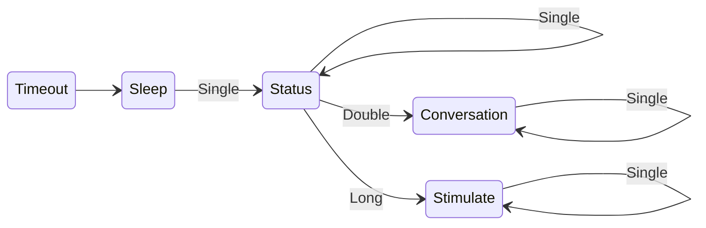
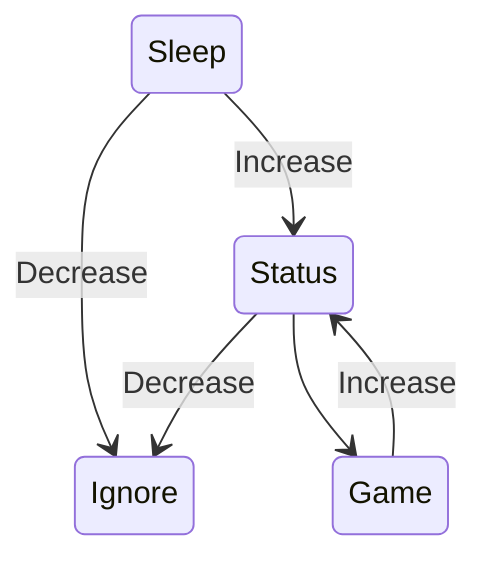
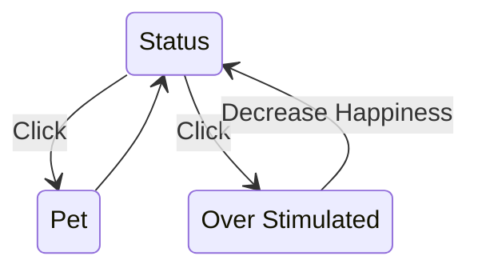
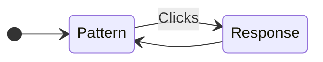
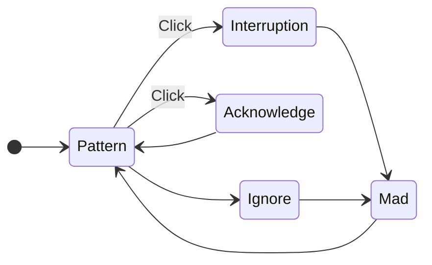
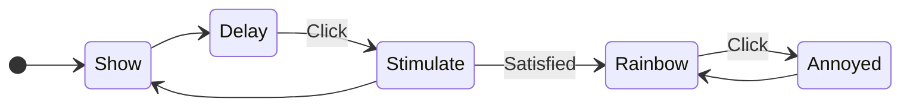
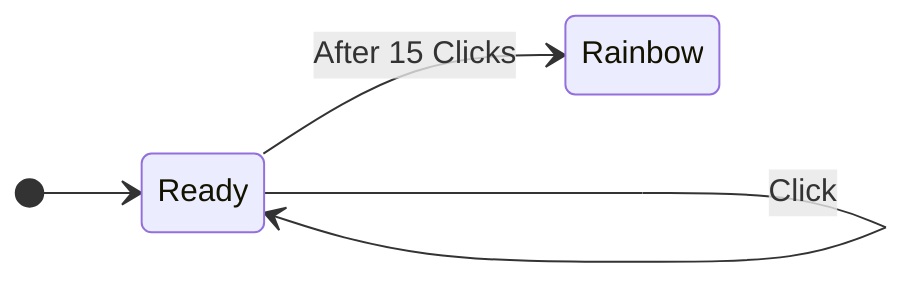

# m8

### Button Use

```mermaid
stateDiagram
    direction LR
    Sleep --> Status: Single
    Status --> Conversation: Double
    Status --> Stimulate: Long
    Status --> Status: Single
    Conversation --> Conversation: Single
    Stimulate --> Stimulate: Single
    Timeout --> Sleep
```

### Happiness

```mermaid
stateDiagram
    Status --> Ignore: Decrease
    Sleep --> Ignore: Decrease
    Sleep --> Status: Increase
    Status --> Game
    Game --> Status: Increase

```

### Pet Game

```mermaid
stateDiagram
    Status --> Pet: Click
    Pet --> Status
    OverStimulated: Over Stimulated
    Status --> OverStimulated: Click
    OverStimulated --> Status: Decrease Happiness

```

### Conversation F
Repeats three times.

```mermaid
stateDiagram
    direction LR
    [*] --> Pattern
    Pattern --> Response: Clicks
    Response --> Pattern
```
### Conversation M
Repeats three times.

```mermaid
stateDiagram
    direction LR
    [*] --> Pattern
    Pattern --> Interruption: Click
    Interruption --> Mad
    Mad --> Pattern
    Pattern --> Acknowledge: Click
    Acknowledge --> Pattern
    Pattern --> Ignore
    Ignore --> Mad
```

### Stimulate F

```mermaid
stateDiagram
    direction LR
    [*] --> Show
    Show --> Delay
    Delay --> Stimulate: Click
    Stimulate --> Show
    Stimulate --> Rainbow: Satisfied
    Rainbow --> Annoyed: Click
    Annoyed --> Rainbow
```

### Stimulate M

```mermaid
stateDiagram
    direction LR
    [*] --> Ready
    Ready --> Ready: Click
    Ready --> Rainbow: After 15 Clicks
```